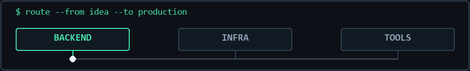

<p align="center">
  
</p>

### `> whoami`

I'm **Ravshanbek Nazarov**, a software engineer in Tashkent, Uzbekistan. I build backend services with **C# and .NET** and enjoy working across infrastructure, automation, and developer tools.

```text
current_focus = ["backend systems", "cloud infrastructure", "developer tooling"]
working_at    = "Abstract IT Group"
```

### `> ls ./selected-work`

| Project | What it is |
| --- | --- |
| [WinGhost](https://github.com/Ravshan04/WinGhost) | Experimental Windows-first terminal emulator built with Rust and ConPTY. |
| [bastion-host](https://github.com/Ravshan04/bastion-host) | Terraform setup for a hardened AWS SSH gateway and private EC2 instance. |
| [Microservice_project](https://github.com/Ravshan04/Microservice_project) | C# microservices project. |
| [Budget.TelegramBot](https://github.com/Ravshan04/Budget.TelegramBot) | C# Telegram bot project. |

### `> cat toolbox.txt`

`C#` `ASP.NET Core` `.NET` `Rust` `Python` `Docker` `Terraform` `AWS` `Linux` `GitHub Actions`

<p align="center">
  
</p>

### `> connect --with-me`

[LinkedIn](https://www.linkedin.com/in/ravshanbek-nazarov-86a347276/) · [Telegram](https://t.me/Mr_Ravshanbekk) · [Explore my repositories](https://github.com/Ravshan04?tab=repositories)

<sub>Built with curiosity. Kept simple on purpose.</sub>
